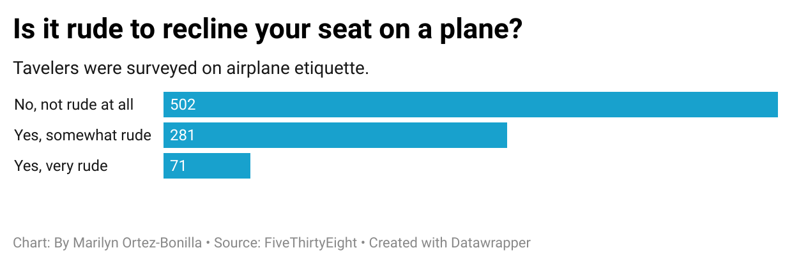

# J124 Week 4 Quiz

## Why I Chose This Question
I chose this question since it is a common debate I often see discussed. There are always mixed opinions on whether reclining seats is appropriate or inappropriate so I found it interesting to find and be able to explore data from a survey trying to determine how the public feels about this and similar issues. 

## What The Chart Reveals
The chart shows that a majority of respondents do not find reclining seats on a plane rude at all. Of a total of 854 respondents, 502 answered "No, not rude at all," 281 answered "Yes, somewhat rude," and 71 answered "Yes, very rude." 

## What I Found Interesting
While I'm not shocked at the most common response, I was taken aback at how stark the difference was since I see both sides pretty equally expressed on social media. I found it interesting how there was a clear majority and minority since I would've previously guessed the answers might be more close.
